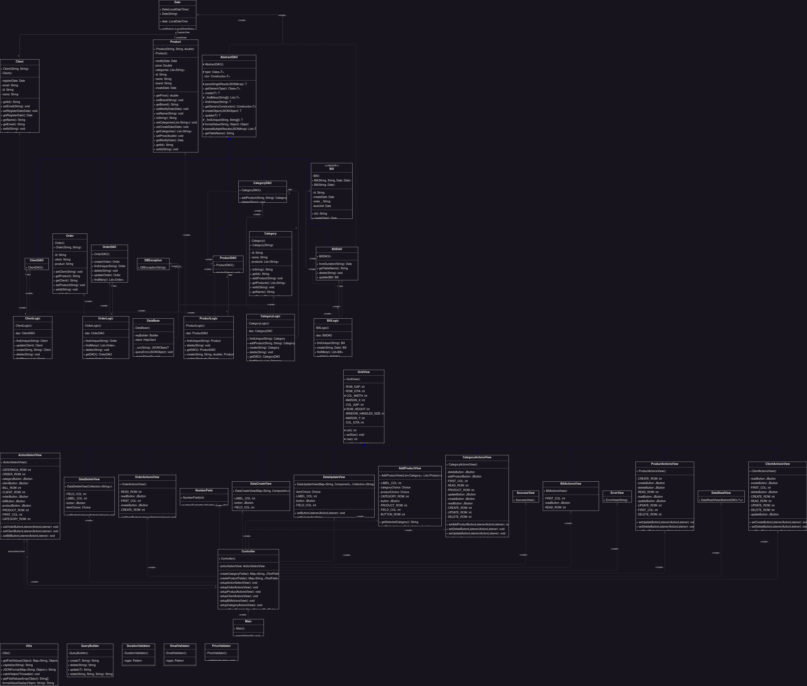

# Assignment 3 - Orders Management

## 1. Assignment Objective

Design and implement an application for managing the client orders for a warehouse.

## 2. Design

### Bill

The `Bill` class is a Java record class that represents a bill. It has the following attributes:

- `id`: A string representing the unique identifier of the bill.
- `order_`: A string representing the order associated with the bill.
- `dueUntil`: A `Date` object representing the due date of the bill.
- `createDate`: A `Date` object representing the creation date of the bill.

The class provides two constructors:

- The primary constructor takes four parameters: `id`, `order_`, `dueUntil`, and `createDate`. It initializes the corresponding attributes with the provided values.
- The secondary constructor takes two parameters: `order_` and `dueUntil`. It sets the `order_` and `dueUntil` attributes with the provided values, while leaving `id` and `createDate` as null.

### Category

The `Category` class is a Java class that represents a category. It has the following attributes:

- `id`: A string representing the unique identifier of the category.
- `name`: A string representing the name of the category.
- `products`: A list of strings representing the products associated with the category.

The class provides several methods to interact with these attributes:

- Constructors:
  - The private default constructor is marked with `@SuppressWarnings("unused")` and sets all attributes to null.
  - The parameterized constructor takes a `name` parameter and initializes the `name` attribute with the provided value, while leaving `id` and `products` as null.

- Getter and Setter methods:
  - `getId()` and `setId(String id)`: Get and set the value of the `id` attribute.
  - `getName()` and `setName(String name)`: Get and set the value of the `name` attribute.
  - `getProducts()` and `setProducts(List<String> products)`: Get and set the value of the `products` attribute.

- Additional methods:
  - `addProduct(String productID)`: Adds a product ID to the list of products associated with the category.

- `toString()` method:
  - Overrides the default `toString()` method to provide a custom string representation of the `Category` object. It uses a `JSONObject` to convert the object to JSON format and returns the JSON string with a "Category: " prefix.

### Client

The `Client` class is a Java class that represents a client. It has the following attributes:

- `id`: A string representing the unique identifier of the client.
- `name`: A string representing the name of the client.
- `email`: A string representing the email address of the client.
- `registerDate`: A `Date` object representing the registration date of the client.

The class provides several methods to interact with these attributes:

- Constructors:
  - The private default constructor is marked with `@SuppressWarnings("unused")` and sets all attributes to null.
  - The parameterized constructor takes `name` and `email` parameters and initializes the corresponding attributes with the provided values, while leaving `id` and `registerDate` as null.

- Getter and Setter methods:
  - `getId()` and `setId(String id)`: Get and set the value of the `id` attribute.
  - `getName()` and `setName(String name)`: Get and set the value of the `name` attribute.
  - `getEmail()` and `setEmail(String email)`: Get and set the value of the `email` attribute.
  - `getRegisterDate()` and `setRegisterDate(Date registeredAt)`: Get and set the value of the `registerDate` attribute.

- `toString()` method:
  - Overrides the default `toString()` method to provide a custom string representation of the `Client` object. It uses a `JSONObject` to convert the object to JSON format and returns the JSON string with a "Client: " prefix.

### Order

The `Order` class is a Java class that represents an order. It has the following attributes:

- `id`: A string representing the unique identifier of the order.
- `client`: A string representing the client associated with the order.
- `product`: A string representing the product associated with the order.

The class provides several methods to interact with these attributes:

- Constructors:
  - The private default constructor is marked with `@SuppressWarnings("unused")` and sets all attributes to null.
  - The parameterized constructor takes `clientID` and `productID` parameters and initializes the corresponding attributes with the provided values, while leaving `id` as null.

- Getter and Setter methods:
  - `getId()` and `setId(String id)`: Get and set the value of the `id` attribute.
  - `getClient()` and `setClient(String clientID)`: Get and set the value of the `client` attribute.
  - `getProduct()` and `setProduct(String productID)`: Get and set the value of the `product` attribute.

- `toString()` method:
  - Overrides the default `toString()` method to provide a custom string representation of the `Order` object. It uses a `JSONObject` to convert the object to JSON format and returns the JSON string with an "Order: " prefix.

### Product

The `Product` class is a Java class that represents a product. It has the following attributes:

- `id`: A string representing the unique identifier of the product.
- `name`: A string representing the name of the product.
- `brand`: A string representing the brand of the product.
- `categories`: A list of strings representing the categories to which the product belongs.
- `price`: A double representing the price of the product.
- `quantity`: An integer representing the quantity of the product.
- `createDate`: A `Date` object representing the creation date of the product.
- `modifyDate`: A `Date` object representing the modification date of the product.

The class provides several methods to interact with these attributes:

- Constructors:
  - The private default constructor is marked with `@SuppressWarnings("unused")` and sets all attributes to null.
  - The parameterized constructor takes `name`, `brand`, `price`, and `quantity` parameters and initializes the corresponding attributes with the provided values, while leaving `id`, `categories`, `createDate`, and `modifyDate` as null.

- Getter and Setter methods:
  - `getId()` and `setId(String id)`: Get and set the value of the `id` attribute.
  - `getName()` and `setName(String name)`: Get and set the value of the `name` attribute.
  - `getBrand()` and `setBrand(String brand)`: Get and set the value of the `brand` attribute.
  - `getCategories()` and `setCategories(List<String> categories)`: Get and set the value of the `categories` attribute.
  - `getPrice()` and `setPrice(double price)`: Get and set the value of the `price` attribute.
  - `getQuantity()` and `setQuantity(int quantity)`: Get and set the value of the `quantity` attribute.
  - `getCreateDate()` and `setCreateDate(Date createdAt)`: Get and set the value of the `createDate` attribute.
  - `getModifyDate()` and `setModifyDate(Date modifiedAt)`: Get and set the value of the `modifyDate` attribute.

- `toString()` method:
  - Overrides the default `toString()` method to provide a custom string representation of the `Product` object. It uses a `JSONObject` to convert the object to JSON format and returns the JSON string with a "Product: " prefix.

## 3. Implementation

### Class Diagram

### Database

SurrealDB is an innovative NewSQL cloud database, suitable for serverless applications, JAMstack applications, single-page applications, and traditional applications. It is unmatched in its versatility and financial value, with the ability for deployment on cloud, on-premise, embedded, and edge computing environments. For a hassle-free setup, get started with SurrealDB Cloud in one-click.

### Interaction with the Database

The `DataBase` class is a Java class that represents a database connection and provides methods to interact with the database server through HTTP requests. Here's a breakdown of its main components:

- Static Fields:
  - `reqBuilder`: A static field of type `HttpRequest.Builder` used to build HTTP requests.
  - `client`: A static field of type `HttpClient` used to send HTTP requests.

- Static Initialization Block:
  - Initializes the `reqBuilder` with the necessary configurations for making HTTP requests to the database server. It sets the URI, request headers, and authorization information.

- Private Constructor:
  - Defines a private constructor, indicating that this class cannot be instantiated.

- `main` Method:
  - It loads a database schema from a file and executes it by calling the `_run` method. The resulting JSON response is printed to the console.

- `_run` Method:
  - Private method that executes a query by sending an HTTP request to the database server. It takes a query string as input, sends the request, and returns the JSON response. If an error occurs during the query execution or if the response indicates an error, a `DBException` is thrown.
  - The method constructs the HTTP request using the `reqBuilder` and sends it using the `client`. It handles the response, checks for any error statuses, and returns the JSON response.

- `run` Method:
  - Public method that executes a query by calling the `_run` method. It takes a query string as input and returns a `JSONArray` containing the result of the query.

- `queryError` Method:
  - Private method that handles an error response from the database server. It prints an error message and the JSON response to the standard error stream and exits the program.

The `QueryBuilder` class provides methods for generating SurrealQL queries used in the `AbstractDAO` class. Here's an overview of its methods:

- Constructor: The constructor is private to prevent instantiation of the class since it contains only static methods.

- `create(Object obj, String table)`: Generates a CREATE statement for a given object and table name. It uses the `Utils.getFieldValues` method to extract the field values of the object and `Utils.JSONFormat` method to format the values as JSON. The method returns the generated CREATE statement as a string.

- `select(String table, String... fields)`: Generates a SELECT statement for a given table and fields. If no fields are specified, it generates a SELECT * statement to retrieve all fields. The method returns the generated SELECT statement as a string.

- `selectFetch(String field, String table, String fetched)`: Generates a SELECT...FETCH query for retrieving records with a fetched alias from a table. It allows selecting a specific field with an alias using the FETCH clause. The method returns the generated SELECT FETCH SurrealQL query as a string.

- `update(Object obj)`: Generates an UPDATE statement for a given object. It uses the `Utils.getFieldValues` method to extract the field values of the object and `Utils.getId` method to retrieve the ID of the object. The method returns the generated UPDATE statement as a string.

- `delete(String id)`: Generates a DELETE statement for a given ID. The method returns the generated DELETE statement as a string.

- `relate(String id1, String verb, String id2)`: Generates a RELATE statement to establish a relationship between two IDs with a given verb. The method returns the generated RELATE statement as a string.

The `AbstractDAO` class is an abstract class in Java that provides a generic implementation for interacting with a database. It defines common methods for creating, retrieving, updating, and deleting objects in the database. Here's a breakdown of its main components:

- Generic Type:
  - The class is defined with a generic type `T` which represents the type of objects being manipulated in the database.

- Fields:
  - `type`: A field of type `Class<T>` that stores the runtime class of the generic type `T`.
  - `ctor`: A field of type `Constructor<T>` that stores the default constructor of the generic type `T`.

- Constructor:
  - The constructor initializes the `type` field by extracting the actual type argument from the generic superclass. It also finds the default constructor for the type and assigns it to the `ctor` field. If a default constructor cannot be found, it throws a `RuntimeException`.

- Public Methods:
  - `getGenericConstructor()`: Returns the `ctor` field, which is the default constructor of the generic type.
  - `getGenericType()`: Returns the `type` field, which is the runtime class of the generic type.
  - `getTableName()`: Returns the simple name of the `type` class, which is used as the table name in the database.

- Protected Methods:
  - `_findUnique(String id, String... fields)`: Executes a SELECT query to retrieve a unique object from the database based on the given ID and fields. It constructs the query using the `QueryBuilder` class, executes it using the `DataBase` class, and returns the parsed result.
  - `_findMany(String... fields)`: Executes a SELECT query to retrieve multiple objects from the database based on the given fields. It constructs the query using the `QueryBuilder` class, executes it using the `DataBase` class, and returns the parsed results.
  - `parseSingleResult(JSONArray arr)`: Parses a single JSON result into an object of type `T`.
  - `parseMultipleResults(JSONArray arr)`: Parses multiple JSON results into a list of objects of type `T`.
  - `formatValue(String fieldType, Object value)`: Formats a value based on its field type. It handles special cases for the "List", "Date", and "Double" types.
  - `createObject(JSONObject obj)`: Creates an object of type `T` from a JSON object. It uses reflection to set the values of the object's fields based on the corresponding keys in the JSON object.

- Public CRUD Methods:
  - `create(T obj)`: Creates a new object in the database by executing the corresponding query. It uses the `QueryBuilder` class to construct the query, executes it using the `DataBase` class, and returns the created object.
  - `findUnique(String id)`: Retrieves a unique object from the database based on the given ID using the `_findUnique` method.
  - `findMany()`: Retrieves multiple objects from the database using the `_findMany` method.
  - `update(T obj)`: Updates an object in the database by executing the corresponding query. It uses the `QueryBuilder` class to construct the query, executes it using the `DataBase` class, and returns the updated object.
  - `delete(String id)`: Deletes an object from the database based on the given ID by executing the corresponding query.

### Data Validation

The `DurationValidator` class provides a static method for validating duration strings using a regular expression pattern. Here's an overview of the class:

- Constructor: The constructor is private to prevent instantiation of the class since it contains only static methods.

- `validate(String duration)`: Validates the duration string using a regular expression pattern. The regular expression pattern consists of optional groups for year (y), week (w), day (d), hour (h), minute (m), second (s), and millisecond (ms). The method checks if the duration string matches the expected pattern and throws an `InvalidDurationException` if it doesn't.

- `InvalidDurationException`: This is a nested class that extends `Exception` and represents an exception that is thrown when an invalid duration is encountered. It overrides the `getMessage()` method to return a custom error message.

The `EmailValidator` class provides a static method for validating email strings using a regular expression pattern. Here's an overview of the class:

- Constructor: The constructor is private to prevent instantiation of the class since it contains only static methods.

- `validate(String email)`: Validates the email string using a regular expression pattern. The regular expression pattern checks if the email string matches the expected format, which includes one or more word characters, followed by an "@" symbol, followed by a domain name consisting of one or more word characters separated by periods. The method throws an `InvalidEmailException` if the email string does not match the pattern.

- `InvalidEmailException`: This is a nested class that extends `Exception` and represents an exception that is thrown when an invalid email is encountered. It overrides the `getMessage()` method to return a custom error message.

The `PriceValidator` class provides a static method for validating price values. Here's an overview of the class:

- Constructor: The constructor is private to prevent instantiation of the class since it contains only static methods.

- `validate(double price)`: Validates the price value by checking if it is less than or equal to 0. If the price value is less than or equal to 0, it throws an `InvalidPriceException`.

- `InvalidPriceException`: This is a nested class that extends `Exception` and represents an exception that is thrown when an invalid price value is encountered. It overrides the `getMessage()` method to return a custom error message.

The `QuantityValidator` class provides a static method for validating quantity values. Here's an overview of the class:

- Constructor: The constructor is private to prevent instantiation of the class since it contains only static methods.

- `validate(int quantity)`: Validates the quantity value by checking if it is less than or equal to 0. If the quantity value is less than or equal to 0, it throws an `InvalidQuantityException`.

- `InvalidQuantityException`: This is a nested class that extends `Exception` and represents an exception that is thrown when an invalid quantity value is encountered. It overrides the `getMessage()` method to return a custom error message.

## 4. Conclusions

In conclusion, the development of the Orders Management application for processing client orders in a warehouse has been successfully completed. The project aimed to create an efficient system that utilizes relational databases to store and manage product, client, and order information. The application facilitates order placement, tracking, and fulfillment processes, enhancing operational efficiency and customer satisfaction.

Following a systematic approach, the project involved analyzing the requirements, designing the application, implementing the necessary functionalities, and ensuring the robustness and reliability of the system. The application consists of classes such as Clients, Products, Orders, and DAO (Data Access Object) that work in tandem to provide seamless management of client orders within the warehouse setting.

The implemented system enables users to create, retrieve, update, and delete client, product, and order records, empowering efficient order processing and inventory management. By leveraging relational databases, the application ensures data integrity and provides real-time access to critical information.

With the completion of this project, businesses can benefit from an effective Orders Management tool that optimizes the processing of client orders. The application empowers decision-making processes related to order fulfillment, allowing businesses to streamline their warehouse operations, improve order accuracy, and enhance overall customer satisfaction.

In summary, the Orders Management application has successfully achieved its objectives, providing a reliable and efficient solution for processing client orders within a warehouse. Its potential to improve operational efficiency and enhance customer service makes it a valuable tool for businesses in various industries

## 5. Biography

- [SurrealDB Docs](https://surrealdb.com/docs)
- [The Mecca of Programmers](https://stackoverflow.com/)
- [Oracle Docs](https://docs.oracle.com/)
- The Provided Laboratory Materials
