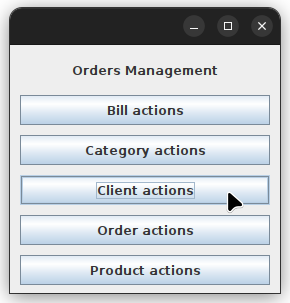
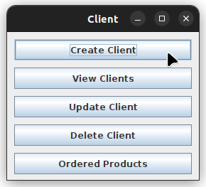
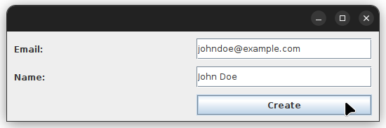
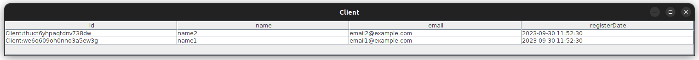

# Orders Management

## Description

An application for client order management in a warehouse, utilizing SurrealDB
as the database, offering basic CRUD functionality.

## Screenshots

### Main View



### Client Actions



### Create A Client



### Display All Clients



## Getting Started

### Prerequisites

- maven

  Debian/Ubuntu:

  ```sh
  sudo apt install maven
  ```

- java 17 jdk

  Debian/Ubuntu:

  ```sh
  sudo apt install openjdk-17-jdk openjdk-17-jre
  ```

- [SurrealDB](https://surrealdb.com/install)

### Installation

1. Clone the repo

   ```sh
   git clone https://github.com/CozmaRares/orders-management.git
   cd orders-management
   ```

2. Compile the code

   ```sh
   mvn compile
   ```

3. Setup the database schema

   ```sh
   mvn exec:java@database-schema
   ```

4. Run the code

   ```sh
   mvn exec:java
   ```

5. Generate the documentation

   ```sh
   mvn javadoc:javadoc
   # generated in target/site/apidocs
   ```

## Design

**_Layered Architecture_**

To ensure a well-structured and organized application, a layered architecture
has been adopted:

### Model Layer

This layer comprises essential classes representing the core entities within the
system. These classes include Bill, Category, Client, Order, and Product. They
serve as the foundational building blocks for the entire application.

### Data Layer

The data layer is responsible for managing data access and
interactions with the underlying database. It includes Data Access Objects
(DAOs) for each model class, which facilitate the retrieval and manipulation of
data. Additionally, this layer encompasses database connection classes to
establish connections with the database management system.

### Logic Layer

The logic layer encapsulates the business logic of the application. It involves
operations related to populating, and validating data.

### Presentation Layer

The presentation layer is responsible for displaying data to end-users.

## Reflection

The Orders Management System for a Warehouse Project is a college assignment
undertaken as part of the Fundamental Programming Techniques class. This project
involves the development of an application to process client orders within a
warehouse environment. The primary focus of this project is on the effective
utilization of relational databases for storing critical data such as product
information, client details, and order records.

The most challenging aspect of the project was crafting a custom database driver,
as the SurrealDB team's provided driver utilized reflection techniques, which I
had to implement independently for data manipulation.

The project was developed using Java, Maven for build automation, and Java Swing
for creating user interfaces. SurrealDB served as the underlying database
management system, ensuring efficient data storage and retrieval. Reflection
techniques were employed for dynamic class inspection. These technologies and
techniques combined to create a robust Orders Management System for a Warehouse Project.
